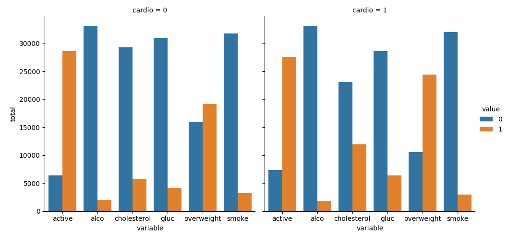
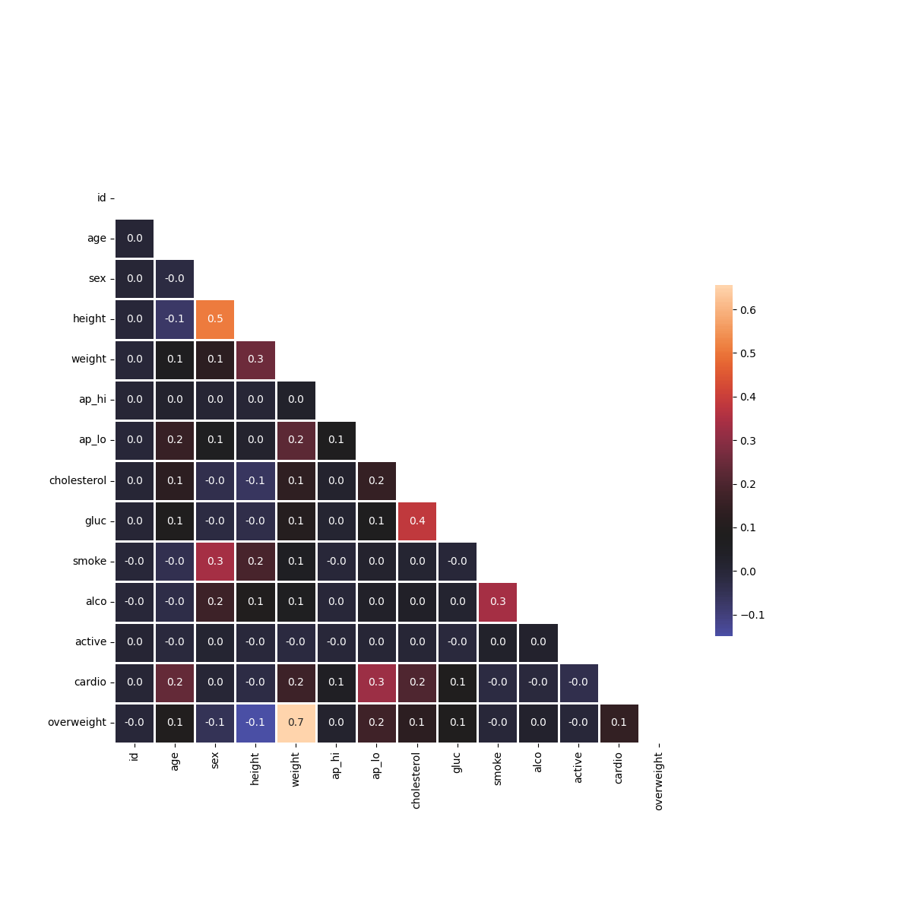

# 🏥 Medical Data Visualizer

This project analyzes and visualizes medical examination data using Python, Pandas, Seaborn, and Matplotlib. It includes categorical plots and heatmaps to explore health indicators and their relationships.

## 📂 Project Structure

```
📂 medical-data-visualizer
 ├── 📄 medical_data_visualizer.py  # Main script for data processing and visualization
 ├── 📄 test_module.py              # Unit tests for validation
 ├── 📄 README.md                   # Documentation
 ├── 📄 requirements.txt             # Dependencies
 ├── 📄 medical_examination.csv      # Dataset containing medical examination data
 ├── 🖼️ catplot.png                 # Generated categorical plot
 ├── 🖼️ heatmap.png                 # Generated heatmap
```

## 🚀 Installation & Usage

### 1️⃣ Clone the Repository

```sh
git clone https://github.com/AlejandroFM-MA/medical-data-visualizer.git
cd medical-data-visualizer
```

### 2️⃣ Install Dependencies

Ensure you have Python 3, Pandas, Seaborn, and Matplotlib installed. You can install the required packages with:

```sh
pip install -r requirements.txt
```

### 3️⃣ Run the Main Script

```sh
python medical_data_visualizer.py
```

### 4️⃣ Run Unit Tests (Optional)

To verify the correctness of the analysis, run:

```sh
python test_module.py
```

## 📊 Explanation of the Code

### 🏋️ 1. Preprocessing the Data
- The dataset `medical_examination.csv` is loaded using Pandas.
- A new column `overweight` is created based on BMI (>25 → 1, otherwise 0).
- The `cholesterol` and `gluc` values are normalized (1 → 0, otherwise 1).

```python
df = pd.read_csv("medical_examination.csv")
df["overweight"] = (df["weight"] / (df["height"] / 100) ** 2).apply(lambda x: 1 if x > 25 else 0)
df["cholesterol"] = df["cholesterol"].apply(lambda x: 0 if x == 1 else 1)
df["gluc"] = df["gluc"].apply(lambda x: 0 if x == 1 else 1)
```

### 📊 2. Drawing Categorical Plots
- The function `draw_cat_plot()` reshapes the data using `melt()` to visualize categorical features.
- A grouped DataFrame counts occurrences of each category.
- A `catplot` is created using Seaborn and saved as `catplot.png`.

```python
df_cat = pd.melt(df, id_vars=["cardio"], value_vars=["cholesterol", "gluc", "smoke", "alco", "active", "overweight"])
df_cat["total"] = 1
df_cat = df_cat.groupby(["cardio", "variable", "value"], as_index=False).count()
fig = sns.catplot(data=df_cat, x="variable", y="total", hue="value", kind="bar", col="cardio").fig
fig.savefig('catplot.png')
```

### 🔥 3. Drawing Heatmaps
- The function `draw_heat_map()` cleans the data and computes the correlation matrix.
- A heatmap is drawn with Matplotlib and Seaborn, saving it as `heatmap.png`.

```python
df_heat = df[(df["ap_lo"] <= df["ap_hi"]) & (df["height"] >= df["height"].quantile(0.025)) & (df["height"] <= df["height"].quantile(0.975)) & (df["weight"] >= df["weight"].quantile(0.025)) & (df["weight"] <= df["weight"].quantile(0.975))]
corr = df_heat.corr(method="pearson")
mask = np.triu(corr)
fig, ax = plt.subplots(figsize=(12,12))
sns.heatmap(corr, mask=mask, annot=True, fmt=".1f", center=0.08, square=True, linewidths=1, cbar_kws={"shrink": 0.5})
fig.savefig('heatmap.png')
```

## 📈 Results of the Analysis

### Categorical Plot
The categorical plot visualizes the distribution of health indicators (cholesterol, glucose, smoking, alcohol consumption, physical activity, and overweight) for individuals with and without cardiovascular disease.



### Heatmap
The heatmap shows correlations between different medical measurements, helping identify trends and relationships.



## 📜 License
This project is open-source and available under the MIT License.

🔍 If you like this project, feel free to ⭐ it on GitHub!

