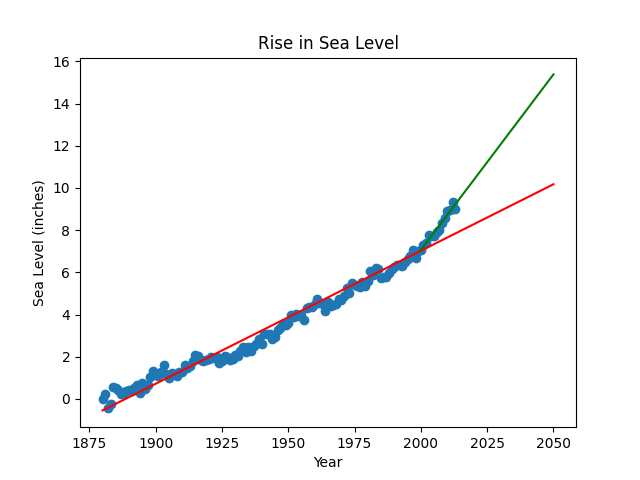

# 🌊 Sea Level Predictor

This project analyzes and visualizes the rise in sea levels using Python, Pandas, Matplotlib, and SciPy. It includes a scatter plot and two linear regression models to predict future sea level trends.

## 🗂 Project Structure

```
📂 sea-level-predictor
 ├── 📄 sea_level_predictor.py  # Main script for analysis and visualization
 ├── 📄 test_module.py         # Unit tests for validation
 ├── 📄 README.md              # Documentation
 ├── 📄 requirements.txt       # Dependencies
 ├── 📄 epa-sea-level.csv      # Dataset containing sea level data
 ├── 🎨 sea_level_plot.png    # Generated plot
```

## 🚀 Installation & Usage

### 1 Clone the Repository

```sh
git clone https://github.com/AlejandroFM-MA/sea-level-predictor.git
cd sea-level-predictor
```

### 2 Install Dependencies

Ensure you have Python 3, Pandas, Matplotlib, and SciPy installed. You can install the required packages with:

```sh
pip install -r requirements.txt
```

### 3 Run the Main Script

```sh
python sea_level_predictor.py
```

### 4 Run Unit Tests (Optional)

To verify the correctness of the analysis, run:

```sh
python test_module.py
```

## 📊 Explanation of the Code

### 📍 1. Reading the Data
- The dataset `epa-sea-level.csv` is loaded using Pandas.
- Yearly sea level measurements are extracted for analysis.

```python
df = pd.read_csv("epa-sea-level.csv")
x = df["Year"]
y = df["CSIRO Adjusted Sea Level"]
```

### 🌀 2. Creating the Scatter Plot
- The function `draw_plot()` generates a scatter plot of the data.

```python
fig, ax = plt.subplots()
plt.scatter(x, y)
```

### 📊 3. Linear Regression & Predictions
#### First Line of Best Fit (1880-2050)
- A linear regression is computed for the entire dataset.
- Predictions are made up to the year 2050.

```python
res = linregress(x, y)
x_pred = pd.Series(range(1880, 2051))
y_pred = res.slope * x_pred + res.intercept
plt.plot(x_pred, y_pred, "r")
```

#### Second Line of Best Fit (2000-2050)
- A second regression is applied only to data from the year 2000 onwards.
- Predictions are extended to 2050 based on recent trends.

```python
new_df = df.loc[df["Year"] >= 2000]
new_x = new_df["Year"]
new_y = new_df["CSIRO Adjusted Sea Level"]
res_2 = linregress(new_x, new_y)
x_pred2 = pd.Series(range(2000, 2051))
y_pred2 = res_2.slope * x_pred2 + res_2.intercept
plt.plot(x_pred2, y_pred2, "green")
```

### 📅 4. Adding Labels and Title
- Labels and a title are added to the plot for clarity.

```python
ax.set_xlabel("Year")
ax.set_ylabel("Sea Level (inches)")
ax.set_title("Rise in Sea Level")
```

### 🎨 5. Saving the Plot
- The generated plot is saved as `sea_level_plot.png`.

```python
plt.savefig('sea_level_plot.png')
```

## 📊 Results of the Analysis

### Scatter Plot with Linear Regressions
The visualization includes:
- The original sea level data points.
- A red regression line based on all available data (1880-2050).
- A green regression line focusing on more recent data (2000-2050).



## 📜 License
This project is open-source and available under the MIT License.

🔍 If you like this project, feel free to ⭐ it on GitHub!


