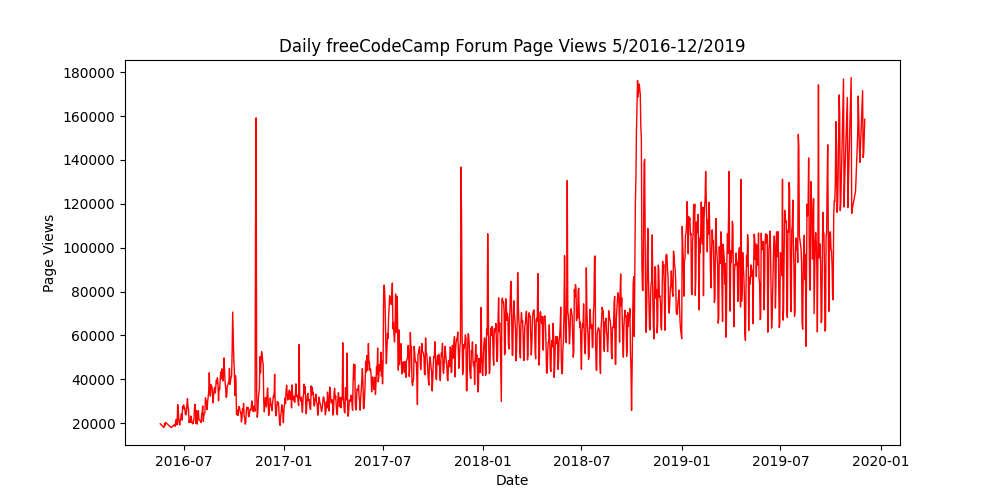
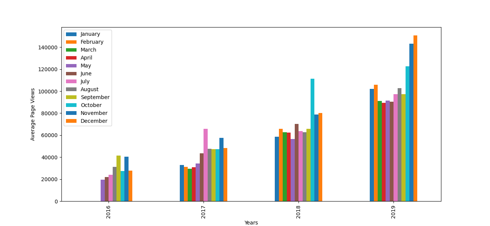
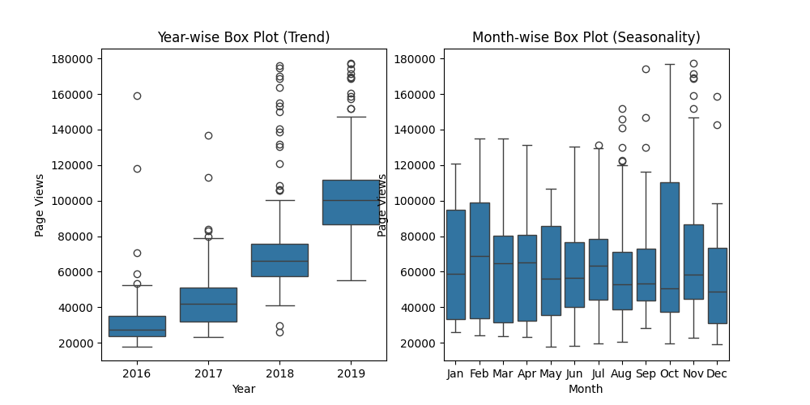

# 📈 Time Series Visualizer

This project analyzes and visualizes time series data using Python, Pandas, Seaborn, and Matplotlib. It includes a line plot, bar plot, and box plots to explore trends and seasonality in page views.

## 📂 Project Structure

```
📂 time-series-visualizer
 ├── 📄 time_series_visualizer.py  # Main script for data processing and visualization
 ├── 📄 test_module.py              # Unit tests for validation
 ├── 📄 README.md                   # Documentation
 ├── 📄 requirements.txt             # Dependencies
 ├── 📄 fcc-forum-pageviews.csv      # Dataset containing time series data
 ├── 🖼️ line_plot.png               # Generated line plot
 ├── 🖼️ bar_plot.png                # Generated bar plot
 ├── 🖼️ box_plot.png                # Generated box plots
```

## 🚀 Installation & Usage

### 1️⃣ Clone the Repository

```sh
git clone https://github.com/AlejandroFM-MA/time-series-visualizer.git
cd time-series-visualizer
```

### 2️⃣ Install Dependencies

Ensure you have Python 3, Pandas, Seaborn, and Matplotlib installed. You can install the required packages with:

```sh
pip install -r requirements.txt
```

### 3️⃣ Run the Main Script

```sh
python time_series_visualizer.py
```

### 4️⃣ Run Unit Tests (Optional)

To verify the correctness of the analysis, run:

```sh
python test_module.py
```

## 📊 Explanation of the Code

### 📆 1. Loading and Cleaning the Data
- The dataset `fcc-forum-pageviews.csv` is loaded using Pandas, with dates parsed as an index.
- Data is cleaned by removing outliers beyond the 2.5th and 97.5th percentiles.

```python
df = pd.read_csv("fcc-forum-pageviews.csv", parse_dates=["date"], index_col="date")
df = df[(df["value"] <= df["value"].quantile(0.975)) & (df["value"] >= df["value"].quantile(0.025))]
```

### 📈 2. Drawing the Line Plot
- The function `draw_line_plot()` creates a time series line plot using Matplotlib.
- The x-axis represents time, and the y-axis represents page views.
- The plot is saved as `line_plot.png`.

```python
fig, ax = plt.subplots(figsize=(10,5))
ax.plot(df.index, df["value"], color="r", linewidth=1)
ax.set_title("Daily freeCodeCamp Forum Page Views 5/2016-12/2019")
ax.set_ylabel("Page Views")
ax.set_xlabel("Date")
fig.savefig('line_plot.png')
```

### 📊 3. Drawing the Bar Plot
- The function `draw_bar_plot()` creates a grouped bar plot showing the monthly average page views per year.
- The dataset is grouped by year and month, and then plotted using Pandas.
- The plot is saved as `bar_plot.png`.

```python
df_bar = df.copy()
df_bar["year"] = df_bar.index.year
df_bar["month"] = df_bar.index.month
df_bar = df_bar.groupby(["year", "month"])["value"].mean().unstack()
fig = df_bar.plot.bar(legend=True, figsize=(13,6), ylabel="Average Page Views", xlabel="Years").figure
plt.legend(["January", "February", "March", "April", "May", "June", "July", "August", "September", "October", "November", "December"])
fig.savefig('bar_plot.png')
```

### 📦 4. Drawing the Box Plots
- The function `draw_box_plot()` creates two box plots: one for yearly trends and one for monthly seasonality.
- Seaborn is used to generate the box plots.
- The plots are saved as `box_plot.png`.

```python
df_box = df.copy()
df_box.reset_index(inplace=True)
df_box['year'] = [d.year for d in df_box.date]
df_box['month'] = [d.strftime('%b') for d in df_box.date]
df_box["month_num"] = df_box["date"].dt.month
df_box = df_box.sort_values("month_num")
fig, axes = plt.subplots(nrows=1, ncols=2, figsize=(10,5))
axes[0] = sns.boxplot(x=df_box["year"], y=df_box["value"], ax=axes[0])
axes[1] = sns.boxplot(x=df_box["month"], y=df_box["value"], ax=axes[1])
axes[0].set_title("Year-wise Box Plot (Trend)")
axes[1].set_title("Month-wise Box Plot (Seasonality)")
fig.savefig('box_plot.png')
```

## 📈 Results of the Analysis

### Line Plot
The line plot visualizes daily page views over time.



### Bar Plot
The bar plot displays average monthly page views, grouped by year.



### Box Plots
The box plots show yearly trends and monthly seasonality in page views.



## 📜 License
This project is open-source and available under the MIT License.

🔍 If you like this project, feel free to ⭐ it on GitHub!

